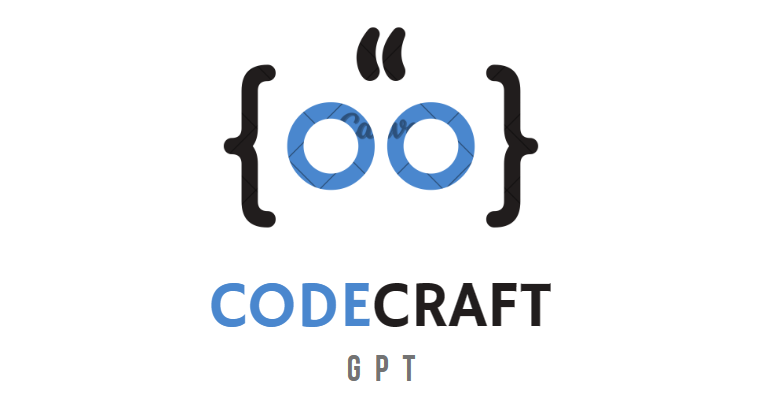

# CodeCraftGPT

<br>
CodeCraft GPT is an innovative, all-in-one platform harnessing the power of advanced Language Models (OpenAI). It seamlessly integrates four key components to elevate the coding experience for developers.

## Prerequisites

Before using this application, ensure you have the following prerequisites in place:

1. **Python:**
    - This project requires Python. Ensure you have Python installed on your system.
    - You can download Python from the [official Python website](https://www.python.org/downloads/).

2. **OpenAI API Key:**
   - To access certain features and functionalities, you'll need a valid [OpenAI API key](https://platform.openai.com/api-keys).
   - If you don't have an API key, you can obtain one by following the instructions on the [OpenAI platform](https://platform.openai.com/signup).

3. **LangChain:**
    - LangChain is a framework designed to simplify the creation of applications using large language models. As a language model integration framework, LangChain's use-cases largely overlap with those of language models in general, including document analysis and summarization, chatbots, and code analysis. Learn about [LangChain](https://python.langchain.com/).

4. **Streamlit:**
    - Streamlit is a free and open-source framework to rapidly build and share beautiful machine learning and data science web apps. It is a Python-based library specifically designed for machine learning engineers. Learn about [Streamlit](https://streamlit.io/). [Installation requirements](https://docs.streamlit.io/library/get-started/installation)

5. **Streamlit-Option-Menu:**
    - streamlit-option-menu is a simple Streamlit component that allows users to select a single item from a list of options in a menu. It is similar in function to st. selectbox(), except that: It uses a simple static list to display the options instead of a dropdown. Learn about [Streamlit-Option-Menu](https://github.com/victoryhb/streamlit-option-menu#:~:text=streamlit%2Doption%2Dmenu-,streamlit%2Doption%2Dmenu%20is%20a%20simple%20Streamlit%20component%20that%20allows,options%20instead%20of%20a%20dropdown).

## How to Set Up the Project Locally

Follow these steps to set up the project:

1. Navigate to your workspace
2. Create a virtual environment by running: `python -m venv env`
3. Activate your virtual environment based on your operating system::

   **Windows:**
   `env/Scripts/activate`

   **Linux or MacOS:**
   `source env/bin/activate`

4. Install dependencies by running the command:

    `pip install -r requirements.txt`

5. In the root directory create a folder called **.streamlit** and inside the folder create a file called **secrets.toml**

   Inside the  `secrets.toml` file add the OpenAI PI key following:

    ```toml
       # secrets.toml

        OPENAI_API_KEY="<ADD your OPEN AI API KEY for local Development>"
    ```

6. Run the application using the following command:

    `streamlit run main.py`

Ensure you follow these steps to successfully set up and run the project. You're ready to explore the full capabilities of our AI-powered development tools.

<!-- TODO refactor ## How to Use the Application

Follow these steps to make the most of our AI-powered development tools:

1. **RefactorRite (Code Refactoring Advisor) 💡:**
   - Input your code snippets or files into RefactorRite.
   - Review the intelligent suggestions for code improvements.
   - Choose to manually apply refinements or let RefactorRite automate the process.

2. **StyleSculpt (Code Style Checker) 🎨:**
   - Upload your code files to StyleSculpt.
   - Receive feedback on coding style and suggestions for enhancement.
   - Implement the recommended changes to improve code quality.

3. **TestGenius (Code Testing and Test Case Generation) 🧪:**
   - Provide your code snippets or functions to TestGenius.
   - Let TestGenius generate comprehensive test cases for your code.
   - Incorporate the generated test cases into your testing suite.

4. **LangLink (Code Translation and Cross-Language Compatibility) 🌐:**
   - Copy and paste code from one programming language into LangLink.
   - Select the target language for translation.
   - Retrieve the translated code with ensured compatibility across languages.

These simple instructions will guide you through the seamless utilization of our AI tools. If you have any questions or encounter issues, feel free to reach out to our support team. -->

<!-- ## Configuration

we will explain any configuration options or settings that users might need to adjust. [if any] -->

## Key Features

### RefactorRite (Code Refactoring Advisor) 💡

Leverage AI-driven code analysis and automated refactoring to enhance code readability, boost performance, and improve maintainability. RefactorRite suggests intelligent refinements and even automates the refactoring process, allowing developers to focus on building robust software.

### StyleSculpt (Code Style Checker) 🎨

Ensure code quality and adherence to coding standards with StyleSculpt. This AI tool provides feedback on coding style, offering suggestions for improvement. By enforcing best practices, StyleSculpt enhances code quality and consistency.

### TestGenius (Code Testing and Test Case Generation) 🧪

Empower developers to create reliable and comprehensive test suites effortlessly. TestGenius uses AI to generate test cases for code snippets, functions, or classes, fostering correctness and enhancing test coverage. This accelerates the development cycle while ensuring robust software quality.

### LangLink (Code Translation and Cross-Language Compatibility) 🌐

Overcome language barriers with LangLink, an AI-powered tool facilitating smooth code translation between programming languages. Developers can confidently migrate codebases, ensuring compatibility and seamless transitions across different languages.

<!-- ## Examples

we will Provide code examples or usage scenarios to help users understand how to use the project in real-world situations.[if any] -->

<!-- ## Contributing

we will explain how others can contribute to the project, including guidelines for reporting issues or submitting pull requests. -->

<!-- ## Testing

We will outline any testing procedures or instructions for users to validate the project. -->

<!-- ## License

we will clearly state the project's license, providing information on how others can use, modify, and distribute the code. -->

<!-- ## Acknowledgments

We will give credit to contributors, libraries, or tools that have been instrumental in the development of the project. -->

<!-- ## Contact Information

we will provide ways for users to contact the project lead or maintainers. -->

<!-- ## FAQs (Frequently Asked Questions):

section for common questions and answers to address potential issues or concerns. -->

<!-- ## Changelog

Log of changes made to the project, including version updates and release notes. -->

<!-- ## Additional Resources

Link to any external documentation, tutorials, or related resources that can help users understand or extend the project. -->

## Technologies Used

1. [Python](https://www.python.org/downloads/)
2. [OpenAI](https://platform.openai.com)
3. [LangChain](https://python.langchain.com/)
4. [StreamLit](https://streamlit.io/)

## Members

### Core Team

- **[Philip Mutua](https://github.com/pmutua)**
  - Role: Team Lead and Developer

- **[Tusiime Ronald](https://github.com/tron66)**
  - Role: Developer

- **[Harrison Wachira](https://github.com/hnjogu)**
  - Role: Developer
